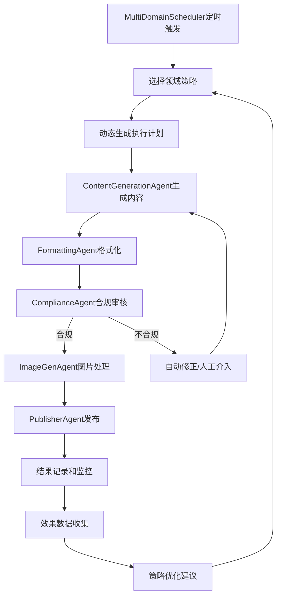

# 多垂直领域社交媒体自动化运营系统 PRD

## 📋 项目概述

### 🎯 目标
构建一个**多垂直领域**的社交媒体自动化运营系统，支持多账号矩阵化运营，从MVP的通用热点驱动模式升级为**垂直领域精细化运营**，提升内容聚焦度和用户粘性。

### 🎨 核心价值主张
1. **多账号并行运营**：支持多个社交媒体账户的独立管理和并行发布
2. **垂直领域精细化**：四大垂直领域（发疯文学、AI科技资讯、每日英语学习、武侠文化）的差异化内容策略
3. **智能工作流编排**：基于LangGraph的Plan-Execute模式，支持动态策略选择
4. **企业级安全合规**：完整的内容合规检查、加密存储、风险控制机制

### 🚀 演进路线图

#### ✅ P1阶段：基础架构重构（已完成）
- 多账户管理系统
- Pydantic数据模型重构
- 异步SQLite数据库
- 加密存储和安全机制

#### ✅ P2阶段：多领域运营系统（当前版本）
- 四大垂直领域策略编排器
- LangGraph Plan-Execute工作流
- 完整小红书发布集成
- 智能调度系统

#### 🔄 P3阶段：功能完善（进行中）
- 微信公众号集成
- 图片生成系统
- 监控Dashboard
- 批量管理工具

#### ❌ P4阶段：智能化增强（规划中）
- AI驱动策略优化
- A/B测试框架
- 跨平台协同
- 高级数据分析

## 🏢 多账号运营架构

### 账号矩阵规划

| 账号名称 | 垂直领域 | 主要平台 | 目标粉丝数 | 运营周期 | 当前状态 |
|---------|---------|---------|------------|----------|----------|
| 每日发疯小剧场 | 发疯文学 | 小红书+抖音 | 10W+ | 6个月 | ✅ 已配置 |
| AI前沿观察 | 科技资讯 | 小红书+公众号 | 5W+ | 8个月 | ✅ 已配置 |
| 英语学习日记 | 英语教育 | 小红书+B站 | 8W+ | 12个月 | ✅ 已配置 |
| 武侠江湖录 | 武侠文化 | 小红书+公众号 | 3W+ | 10个月 | ✅ 已配置 |

### 账号管理策略

**✅ 已实现功能：**
1. **差异化定位**：每个账号独立人设和风格，避免同质化
2. **独立配置管理**：支持不同平台认证方式（cookie/API key）
3. **加密存储**：Fernet加密保护敏感凭证
4. **健康监控**：账号状态监控，发布成功率追踪

**🔄 部分实现功能：**
1. **协同效应**：热点事件多账号不同角度解读（需要手动协调）
2. **内容素材共享池**：基础框架完成，需要内容库扩展

**❌ 待实现功能：**
1. **智能互动引流**：账号间适度互动，避免过度关联
2. **粉丝画像分析**：用户行为分析和内容推荐优化
3. **风险预警系统**：自动化风险检测和预警机制

## 🎨 垂直领域战略设计

### 领域矩阵概览

| 领域 | 目标用户 | 内容特点 | 发布频率 | 竞争优势 | 实现状态 |
|-----|---------|---------|----------|----------|----------|
| 发疯文学 | 打工人、学生党 | 幽默吐槽、情感共鸣 | 每日2次 | 模板化+随机性 | ✅ 完整实现 |
| AI科技资讯 | 科技从业者、爱好者 | 专业解读、信息整理 | 热点驱动 | 时效性+专业性 | ✅ 基础实现 |
| 每日英语学习 | 英语学习者 | 系统化教学内容 | 每日1次 | 课程化+渐进式 | ✅ 基础实现 |
| 武侠文化 | 武侠小说爱好者 | 深度内容、文化传承 | 每周4次 | IP价值+深度解析 | ✅ 基础实现 |

### 1. 发疯文学账号策略

**✅ 已实现功能：**
- **定位**：日常生活的幽默出口，打工人情感共鸣平台
- **内容策略**：模板化创作+随机变量注入，不依赖实时热点
- **发布策略**：每日2次（午休12:30、下班后18:30）
- **格式特征**：自嘲幽默、情感共鸣、适度夸张、正能量收尾

**模板示例（已实现）：**
```
今日份打工感悟：
[随机场景]让我深刻理解了什么叫做[随机情绪]
不过想想[积极结尾]，还是很[正面词汇]的！
#发疯文学 #打工人日常 #今日份感悟
```

**🔄 优化方向：**
- 增加更多模板变体
- 基于用户反馈优化内容策略
- 增加季节性和节日相关内容

### 2. AI科技资讯账号策略

**✅ 已实现功能：**
- **定位**：AI/科技领域的信息整理者和趋势观察者
- **信息来源**：结合MCP热点服务+专业科技媒体
- **处理方式**：专业解读+结构化总结+观点输出

**内容模板（已实现）：**
```
🤖 AI前沿速递
【今日关键】[事件标题]
【核心信息】
• 关键点1
• 关键点2  
• 关键点3
【影响分析】[专业解读]
【观点】[个人见解]
#AI资讯 #科技前沿 #趋势分析
```

**🔄 待完善功能：**
- 实时热点抓取和分析
- 专业术语解释和科普
- 行业专家观点整合

### 3. 每日英语学习账号策略

**✅ 已实现功能：**
- **定位**：系统化英语学习助手，陪伴式教育内容
- **课程化设计**：建立学习体系，循序渐进
- **发布策略**：每日固定时间（早8:00），培养学习习惯

**教学模板（已实现）：**
```
📚 每日英语 Day [N]
【今日单词】[Word] /发音/
【词性】[词性] 
【释义】[中文解释]
【例句】[English sentence]
【翻译】[中文翻译]
【练习】用这个词造个句子吧！
#每日英语 #英语学习 #单词积累
```

**🔄 待完善功能：**
- 学习进度追踪
- 互动练习和测试
- 学习效果评估

### 4. 武侠文化账号策略

**✅ 已实现功能：**
- **定位**：武侠文化传承者，IP内容深度解析
- **内容深度**：人物分析、武功解析、文化背景
- **发布策略**：每周4次（周二、四、六、日）

**内容模板（已实现）：**
```
⚔️ 武侠人物志·[人物名]
【基本信息】
门派：[门派]
武功：[主要武功]
性格：[性格特点]

【人物解析】
[详细分析其性格、经历、成长轨迹]

【武功特色】
[武功特点和文化内涵]

【现代启示】
[人物精神的现代价值]

#武侠文化 #[人物名] #[作者]小说
```

**🔄 待完善功能：**
- IP价值挖掘和现代化解读
- 与热门影视作品的关联
- 互动讨论和用户UGC

## 🔧 核心功能与流程设计

### ✅ 已实现的核心功能

#### 1. 多账户管理系统
- **AccountManager**：支持多账户配置和认证管理
- **加密存储**：Fernet加密保护敏感凭证
- **交互工具**：`add_account_interactive.py`、`manage_accounts.py`
- **健康监控**：账户状态监控，发布成功率追踪

#### 2. 领域策略编排系统
- **四大领域编排器**：FengkuangOrchestrator、AITechOrchestrator等
- **动态策略选择**：DOMAIN_PLANNER_REGISTRY映射机制
- **Plan-Execute模式**：LangGraph驱动的工作流编排

#### 3. 内容生成与处理流程



#### 4. 小红书完整发布流程
- **SocialAutoUploadClient**：完整集成social-auto-upload
- **话题激活功能**：支持#话题名称[话题]#格式，确保话题可点击
- **Cookie管理**：LoginManager自动刷新和管理
- **风控规避**：随机延迟、内容随机化、隐身脚本

#### 5. 智能调度系统
- **MultiDomainScheduler**：支持多账户×多领域矩阵调度
- **差异化策略**：不同领域不同发布时间和频率
- **并发控制**：任务优先级和资源分配管理
- **故障恢复**：自动重试和异常处理

### 🔄 部分实现的功能

#### 6. 图片生成系统
- **基础框架**：ImageGenAgent接口完成
- **待集成API**：DALL-E、Stable Diffusion等
- **智能匹配**：根据内容自动生成图片描述

#### 7. 监控和分析系统
- **基础观测性**：ObservabilityService日志和事件记录
- **待实现Dashboard**：Web界面和数据可视化
- **待完善分析**：跨账户效果分析和优化建议

### ❌ 待实现的功能（P3/P4阶段）

#### 8. 微信公众号集成
- **API客户端**：微信公众号发布接口
- **内容适配**：长文本格式和排版优化
- **素材管理**：图片和视频素材上传

#### 9. 高级数据分析
- **效果追踪**：阅读量、点赞、评论、转发数据收集
- **用户画像**：粉丝行为分析和偏好识别
- **策略优化**：基于数据的内容策略自动调整

#### 10. A/B测试框架
- **实验设计**：不同内容策略的对比测试
- **效果评估**：统计显著性分析
- **自动优化**：基于测试结果的策略调整

## 🛡️ 风险控制与合规策略

### ✅ 已实现的风控措施

#### 1. 内容合规检查
- **ComplianceAgent**：多层次内容审核机制
- **敏感词过滤**：关键词黑名单检查
- **LLM辅助审核**：智能内容合规性判断
- **向量去重**：防止内容重复发布

#### 2. 平台风控规避
- **随机化策略**：发布时间、内容格式的随机变化
- **模拟真人行为**：浏览器自动化的人性化操作
- **隐身技术**：Stealth脚本避免检测
- **频率控制**：合理的发布间隔和限流机制

#### 3. 账号安全管理
- **加密存储**：Fernet加密保护cookies和密钥
- **独立配置**：每个账号独立的登录信息和配置
- **健康监控**：实时监控账号状态和风险指标
- **自动恢复**：登录失效的自动重新认证

### 🔄 待完善的风控措施

#### 4. 智能风险预警
- **异常检测**：发布成功率异常下降的自动告警
- **行为分析**：用户互动模式的异常识别
- **预防性暂停**：风险阈值触发的自动暂停机制

#### 5. 法律合规保障
- **内容审核升级**：更严格的政治敏感内容检查
- **版权保护**：图片和文本的版权风险评估
- **数据隐私**：用户数据处理的合规性检查

## 📊 效果追踪与分析

### ✅ 当前监控能力

#### 1. 技术指标监控
- **发布成功率**：各平台发布操作的成功率统计
- **系统健康度**：Agent状态、数据库连接、API可用性
- **性能指标**：内容生成时间、发布耗时、资源使用率
- **错误追踪**：详细的错误日志和异常处理记录

#### 2. 业务指标收集
- **内容生成量**：各领域每日生成的内容数量
- **发布频率**：实际发布与计划发布的对比
- **内容质量**：LLM评估的内容质量分数
- **合规通过率**：内容审核的通过率统计

### 🔄 待完善的分析能力

#### 3. 用户互动数据
- **阅读量统计**：各平台内容的曝光和阅读数据
- **互动指标**：点赞、评论、收藏、转发数据收集
- **粉丝增长**：新增粉丝数量和增长趋势
- **用户行为**：用户访问时间、停留时长、跳转路径

#### 4. 跨账户分析
- **效果对比**：不同账户在相同领域的表现对比
- **内容效果**：不同内容类型和风格的效果分析
- **最佳实践**：高表现内容的特征识别和总结
- **协同效应**：多账户联动的效果评估

### ❌ 待实现的高级分析

#### 5. 智能优化建议
- **内容策略优化**：基于数据的内容方向调整建议
- **发布时机优化**：最佳发布时间窗口的动态调整
- **用户偏好分析**：目标用户群体偏好的深度分析
- **竞品对比分析**：同领域优秀账户的策略学习

## 🚀 技术架构升级要求

### ✅ P2阶段已完成的技术升级

#### 1. 核心架构调整
- **多账户管理系统**：从单一工作流升级为多账号并行管理
- **领域策略引擎**：替代统一graph编排，支持四大垂直领域独立工作流
- **Agent池化管理**：建立专门的领域化Agent组合和通用执行Agent池

#### 2. 技术选型升级
- **LangChain/LangGraph**：Plan-Execute模式的工作流编排
- **Pydantic数据模型**：类型安全的数据验证和序列化
- **异步SQLite**：aiosqlite驱动的高性能数据库操作
- **Fernet加密**：企业级的数据加密和安全保护

#### 3. 数据存储升级
- **关系型数据库**：账号配置、发布记录、效果数据的结构化存储
- **向量数据库**：内容去重和相似度检索（ChromaDB集成）
- **配置管理**：环境变量和配置文件的统一管理

### 🔄 P3阶段技术规划

#### 4. 监控系统升级
- **Web Dashboard**：基于FastAPI的管理界面
- **实时监控**：WebSocket驱动的实时状态更新
- **数据可视化**：图表和报表的动态生成

#### 5. API服务扩展
- **RESTful API**：完整的HTTP API接口
- **GraphQL支持**：灵活的数据查询接口
- **Webhook集成**：第三方系统的事件通知

### ❌ P4阶段技术展望

#### 6. 智能化增强
- **机器学习集成**：内容效果预测和策略优化
- **自然语言处理**：更智能的内容生成和理解
- **推荐算法**：个性化内容推荐和用户匹配

#### 7. 分布式架构
- **微服务化**：模块解耦和独立部署
- **容器化部署**：Docker和Kubernetes支持
- **云原生架构**：弹性伸缩和高可用性

## 📈 商业价值与ROI分析

### 💰 成本节约
- **人工成本节约**：自动化运营减少80%的人工投入
- **时间效率提升**：24/7自动化运营，提升300%的内容产出
- **质量一致性**：标准化流程确保内容质量稳定

### 📊 业务价值提升
- **多账户矩阵**：4个垂直领域×多个账户的规模化运营
- **精准定位**：垂直领域的精细化运营提升用户粘性
- **数据驱动**：基于数据的策略优化和效果提升

### 🎯 预期效果指标
- **粉丝增长**：各账户月均粉丝增长20%+
- **内容质量**：LLM评估质量分数8.0+/10
- **发布成功率**：平台发布成功率95%+
- **用户互动**：平均互动率提升50%+

## 🔮 后续迭代方向

### P3阶段：功能完善（Q2 2025）
1. **微信公众号集成**：完整的微信生态支持
2. **图片生成系统**：AI图片生成和智能匹配
3. **监控Dashboard**：Web界面和数据可视化
4. **批量管理工具**：CLI和Web管理界面

### P4阶段：智能化增强（Q3-Q4 2025）
1. **AI驱动优化**：基于数据的策略自动调整
2. **A/B测试框架**：内容效果对比和优化
3. **跨平台协同**：多平台内容同步和差异化
4. **用户画像分析**：深度用户行为分析和个性化推荐

### 长期愿景：生态化运营（2026+）
1. **KOL合作平台**：与真人博主的协作机制
2. **商业化变现**：广告投放和商品推广功能
3. **社群运营**：用户社群的自动化管理
4. **品牌IP建设**：垂直领域的品牌价值构建

## 📋 实施检查清单

### ✅ P2阶段完成项
- [x] 多账户管理系统实现
- [x] 四大领域策略编排器开发
- [x] LangGraph工作流系统集成
- [x] 小红书完整发布流程
- [x] 智能调度系统开发
- [x] 加密存储和安全机制
- [x] 基础监控和日志系统
- [x] 端到端测试验证

### 🔄 P3阶段进行项
- [ ] 微信公众号API集成
- [ ] 图片生成系统完善
- [ ] Web Dashboard开发
- [ ] 批量管理工具
- [ ] 高级数据分析
- [ ] A/B测试框架基础

### ❌ P4阶段规划项
- [ ] AI驱动策略优化
- [ ] 机器学习模型集成
- [ ] 跨平台协同机制
- [ ] 用户画像和推荐系统
- [ ] 商业化功能开发
- [ ] 生态化运营平台

---

**当前版本：P2阶段 - 多账户多领域运营系统**  
**文档版本：v2.0.0**  
**最后更新：2025年1月**


